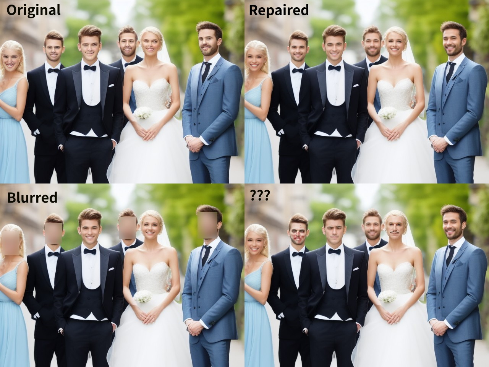
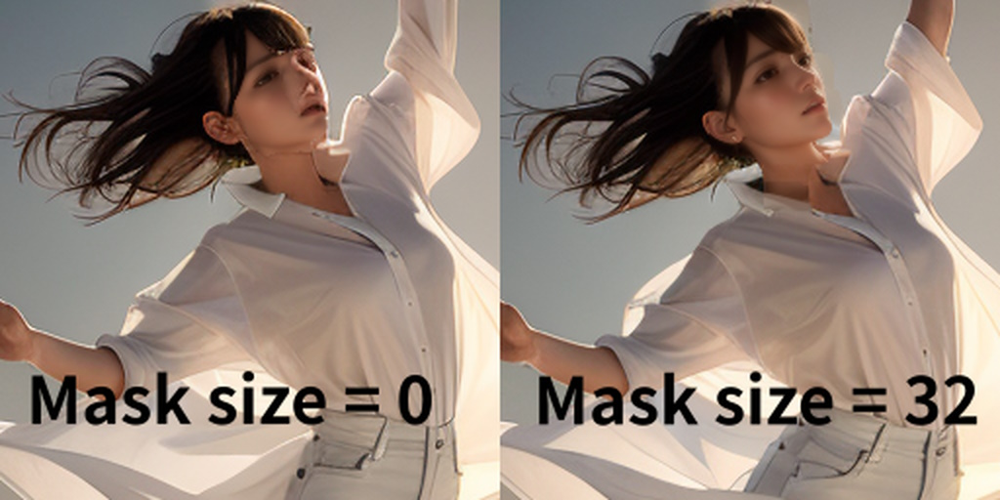
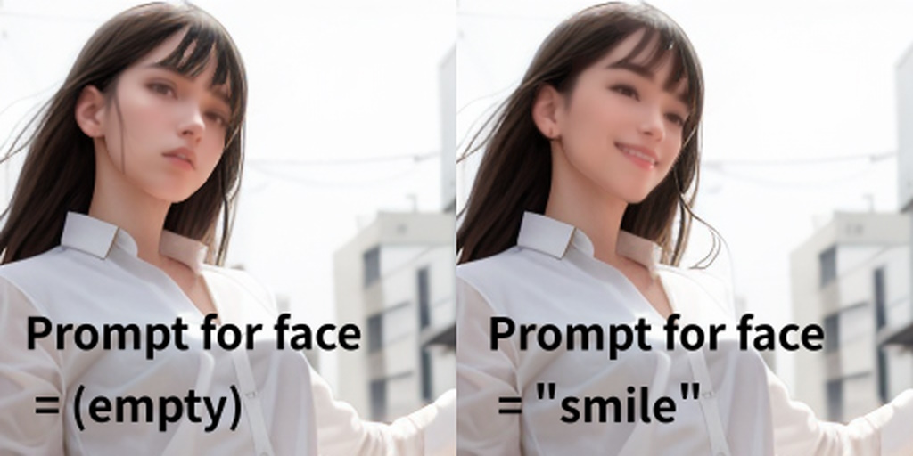
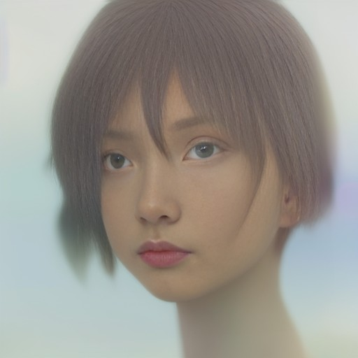
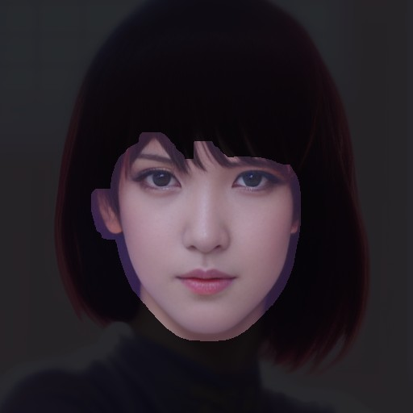
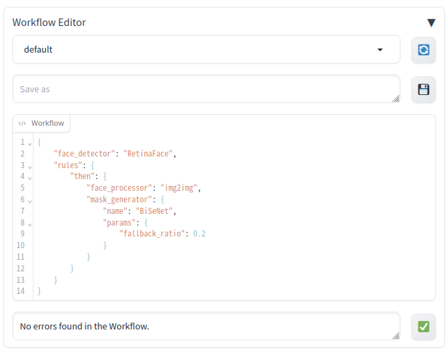
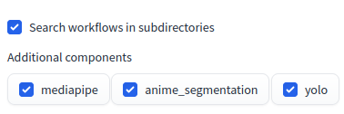

# Face Editor
Face Editor for Stable Diffusion. This Extension is useful for the following purposes:

- Fixing broken faces
- Changing facial expressions
- Apply blurring or other processing



This is a [extension](https://github.com/AUTOMATIC1111/stable-diffusion-webui/wiki/Extensions) of [AUTOMATIC1111's Stable Diffusion Web UI](https://github.com/AUTOMATIC1111/stable-diffusion-webui).

## Setup
1. Open the "Extensions" tab then the "Install from URL" tab.
2. Enter "https://github.com/ototadana/sd-face-editor.git" in the "URL of the extension's git repository" field.
   
3. Click the "Install" button and wait for the "Installed into /home/ototadana/stable-diffusion-webui/extensions/sd-face-editor. Use Installed tab to restart." message to appear.
4. Go to "Installed" tab and click "Apply and restart UI".


## Usage
1. Click "Face Editor" and check **"Enabled"**.
   
2. Then enter the prompts as usual and click the "Generate" button to modify the faces in the generated images.
   
3. If you are not satisfied with the results, adjust the [parameters](#parameters) and rerun. see [Tips](#tips).


## Tips
### Contour discomfort
If you feel uncomfortable with the facial contours, try increasing the **"Mask size"** value. This discomfort often occurs when the face is not facing straight ahead.



If the forelock interferes with rendering the face properly, generally, selecting "Hair" from **"Affected areas"** results in a more natural image.


This setting modifies the mask area as illustrated below: 


---
### When multiple faces are close together
When multiple faces are close together, one face may collapse under the influence of the other.
In such cases, enable **"Use minimal area (for close faces)"**.


---
### Change facial expression
Use **"Prompt for face"** option if you want to change the facial expression.



#### Individual instructions for multiple faces


Faces can be individually directed with prompts separated by `||` (two vertical lines).


- Each prompt is applied to the faces on the image in order from left to right.
- The number of prompts does not have to match the number of faces to work.
- If you write the string `@@`, the normal prompts (written at the top of the screen) will be expanded at that position.
- If you are using the [Wildcards Extension](https://github.com/AUTOMATIC1111/stable-diffusion-webui-wildcards), you can use the `__name__` syntax and the text file in the directory of the wildcards extension as well as the normal prompts.

---
### Fixing images that already exist
If you wish to modify the face of an already existing image instead of creating a new one, follow these steps:

1. Open the image to be edited in the img2img tab
   It is recommended that you use the same settings (prompt, sampling steps and method, seed, etc.) as for the original image. 
   So, it is a good idea to start with the **PNG Info** tab.
   1. Click **PNG Info** tab.
   2. Upload the image to be edited.
   3. Click **Send to img2img** button.
2. Set the value of **"Denoising strength"** of img2img to `0`. This setting is good for preventing changes to areas other than the faces and for reducing processing time.
3. Click "Face Editor" and check "Enabled".
4. Then, set the desired parameters and click the Generate button.

---
## How it works
This script performs the following steps:

### Step 0
First, image(s) are generated as usual according to prompts and other settings. This script acts as a post-processor for those images.

### Step 1. Face Detection
<details>
<summary>Detects faces on the image.</summary>

   
</details>


### Step 2. Crop and Resize the Faces
<details>
<summary>Crop the detected face image and resize it to 512x512.</summary>


</details>

### Step 3. Recreate the Faces
<details>
<summary>Run <b>img2img</b> with the image to create a new face image.</summary>


</details>

### Step 4. Paste the Faces
<details>
<summary>Resize the new face image and paste it at the original image location.</summary>


</details>

### Step 5. Blend the entire image
<details>
<summary>To remove the borders generated when pasting the image, mask all but the face and run <b>inpaint</b>.</summary>


</details>

### Completed
<details>
<summary>Show sample image</summary>


</details>

## Parameters
### Basic Options
##### Workflow
Select a workflow. "Search workflows in subdirectories" can be enabled in the Face Editor section of the "Settings" tab to try some experimental workflows. You can also add your own workflows.

For more detailed information, please refer to the [Workflow Editor](#workflow-editor) section.

##### Use minimal area (for close faces)
When pasting the generated image to its original location, the rectangle of the detected face area is used. If this option is not enabled, the generated image itself is pasted. In other words, enabling this option applies a smaller face image, while disabling it applies a larger face image.

##### Save original image
This option allows you to save the original, unmodified image.

##### Show original image
This option allows you to display the original, unmodified image.

##### Show intermediate steps
This option enables the display of images that depict detected faces and masks.
If the generated image is unnatural, enabling it may reveal the cause.

##### Prompt for face
Prompt for generating a new face.
If this parameter is not specified, the prompt entered at the top of the screen is used.

For more information, please see: [here](#change-facial-expression).


##### Mask size (0-64)
Size of the mask area when inpainting to blend the new face with the whole image.

<details>
<summary>Show sample images</summary>

**size: 0**


**size: 10**


**size: 20**

</details>


##### Mask blur (0-64)
Size of the blur area when inpainting to blend the new face with the whole image.


---
### Advanced Options
#### Step 1. Face Detection
##### Maximum number of faces to detect (1-20)
Use this parameter when you want to reduce the number of faces to be detected.
If more faces are found than the number set here, the smaller faces will be ignored.

##### Face detection confidence (0.7-1.0)
Confidence threshold for face detection. Set a lower value if you want to detect more faces.

#### Step 2. Crop and Resize the Faces
##### Face margin (1.0-2.0)
Specify the size of the margin for face cropping by magnification.

If other parameters are exactly the same but this value is different, the atmosphere of the new face created will be different.

<details>
<summary>Show sample images</summary>


</details>


##### Size of the face when recreating 
Specifies one side of the image size when creating a face image. Normally, there should be no need to change this from the default value (512), but you may see interesting changes if you do.

##### Ignore faces larger than specified size
Ignore if the size of the detected face is larger than the size specified in "Size of the face when recreating".

For more information, please see: [here](https://github.com/ototadana/sd-face-editor/issues/65).

#### Step 3. Recreate the Faces
##### Denoising strength for face images (0.1-0.8)
Denoising strength for generating a new face.
If the value is too small, facial collapse cannot be corrected, but if it is too large, it is difficult to blend with the entire image.

<details>
<summary>Show sample images</summary>

**strength: 0.4**


**strength: 0.6**


**strength: 0.8**

</details>


#### Step 4. Paste the Faces
##### Apply inside mask only
Paste an image cut out in the shape of a face instead of a square image.

For more information, please see: [here](https://github.com/ototadana/sd-face-editor/issues/33).

#### Step 5. Blend the entire image
##### Denoising strength for the entire image (0.0-1.0)
Denoising strength when inpainting to blend the new face with the whole image.
If the border lines are too prominent, increase this value.

---
## API
If you want to use this script as an extension (alwayson_scripts) in the [API](https://github.com/AUTOMATIC1111/stable-diffusion-webui/wiki/API), specify **"face editor ex"** as the script name as follows:

```
   "alwayson_scripts": {
      "face editor ex": {
         "args": [{"prompt_for_face": "smile"}]
      },
```

By specifying an **object** as the first argument of args as above, parameters can be specified by keywords. We recommend this approach as it can minimize the impact of modifications to the software. If you use a script instead of an extension, you can also specify parameters in the same way as follows:

```
   "script_name": "face editor",
   "script_args": [{"prompt_for_face": "smile"}],
```

- See [source code](https://github.com/ototadana/sd-face-editor/blob/main/scripts/entities/option.py) for available keywords.

---
## Workflow Editor
Workflow Editor is where you can customize and experiment with various options beyond just the standard settings. 



- The editor allows you to select from a variety of implementations, each offering unique behaviors compared to the default settings.
- It provides a platform for freely combining these implementations, enabling you to optimize the workflow according to your needs.
- Within this workflow, you will define a combination of three components: the "Face Detector" for identifying faces within an image, the "Face Processor" for adjusting the detected faces, and the "Mask Generator" for integrating the processed faces back into the original image.
- As you experiment with different settings, ensure to activate the "Show intermediate steps" option. This allows you to understand precisely the impact of each modification.

### Using the Workflow Editor UI
#### Workflow list and Refresh button


- Lists workflow definition files (.json) stored in the [workflows](workflows) folder.
- The option "Search workflows in subdirectories" can be enabled in the Face Editor section of the "Settings" tab to use sample workflow definition files.
- The Refresh button (🔄) can be clicked to update the contents of the list.

#### File name and Save button


- This feature is used to save the edited workflow definition.
- A file name can be entered in the text box and the Save button (💾) can be clicked to save the file.

#### Workflow definition editor and Validation button


- This feature allows you to edit workflow definitions. Workflows are described in JSON format.
- The Validation button (✅) can be clicked to check the description. If there is an error, it will be displayed in the message area to the left of the button.

----
## Example Workflows

In the following sections, we'll describe some example workflows to help you get started. Each description includes a link to the workflow's JSON definition. You can use these workflows as they are, or you can customize them to suit your needs.

Details to note:
- The [workflows/examples](workflows/examples) folder contains workflow definitions that can be used as a reference when users create their own workflows.
- To access these example workflow definitions in the `workflows/examples` folder from the workflow list in the Workflow Editor, the "Search workflows in subdirectories" option must be enabled. This option is located in the Face Editor section of the "Settings" tab.
- These workflow definitions can be used as they are, or you can customize them and save them under a different name for personal use.
- Please note that some workflows require specific "Additional components" to be enabled in the Face Editor section of the "Settings" tab for them to function correctly.




### Example 1: Basic Workflow - MediaPipe

This workflow uses the MediaPipe face detector and applies the 'img2img' face processor and 'MediaPipe' mask generator to all detected faces.

[View the workflow definition](workflows/examples/mediapipe.json)

Please note that to use this workflow, the 'MediaPipe' option under "Additional components" in the Face Editor section of the "Settings" tab needs to be enabled.

This is a good starting point for creating more complex workflows. You can customize this by changing the face detector or face processor, adding parameters, or adding conditions to apply different processing to different faces.


### Example 2: Basic Workflow - YOLO Example

This workflow uses the YOLO face detector and applies the 'img2img' face processor and 'YOLO' mask generator to all detected faces. 

[View the workflow definition](workflows/examples/yolov8n.json)

Please note that to use this workflow, the 'YOLO' option under "Additional components" in the Face Editor section of the "Settings" tab needs to be enabled. Also, you need to use a model trained for face detection, as the `yolov8n.pt` model specified here does not support face detection.

Like the MediaPipe workflow, this is a good starting point for creating more complex workflows. You can customize it in the same ways.


### Example 3: High Accuracy Face Detection Workflow - Bingsu/adetailer Example

This workflow uses the YOLO face detector, but it employs a model that is actually capable of face detection. From our testing, the accuracy of this model in detecting faces is outstanding. For more details on the model, please check [Bingsu/adetailer](https://huggingface.co/Bingsu/adetailer).

[View the workflow definition](workflows/examples/adetailer.json)

Please note that to use this workflow, the 'YOLO' option under "Additional components" in the Face Editor section of the "Settings" tab needs to be enabled. 


### Example 4: Anime Face Detection Workflow - lbpcascade_animeface Example

This workflow uses the `lbpcascade_animeface` face detector, which is specially designed for detecting anime faces. The source of this detector is the widely known [lbpcascade_animeface](https://github.com/nagadomi/lbpcascade_animeface) model. 

[View the workflow definition](workflows/examples/lbpcascade_animeface.json)


### Example 5: Simple Face Blurring

This workflow is straightforward and has a single, simple task - blurring detected faces in an image. It uses the `RetinaFace` method for face detection, which is a reliable and high-performance detection algorithm.

[View the workflow definition](workflows/examples/blur.json)

The `Blur` face processor is employed here, which, as the name suggests, applies a blur effect to the detected faces. For masking, the workflow uses the `NoMask` mask generator. This is a special mask generator that doesn't mask anything - it simply allows the entire face to pass through to the face processor.

As a result, the entire area of each detected face gets blurred. This can be useful in situations where you need to anonymize faces in images for privacy reasons.


### Example 6: Different Processing Based on Face Position

This workflow employs the `RetinaFace` face detector and applies different processing depending on the position of the detected faces in the image. 

[View the workflow definition](workflows/examples/blur_non_center_faces.json)

For faces located in the center of the image (as specified by the `"criteria": "center"` condition), the `img2img` face processor and `BiSeNet` mask generator are used. This means that faces in the center of the image will be subject to advanced masking and img2img transformations.

On the other hand, for faces not located in the center, the `Blur` face processor and `NoMask` mask generator are applied, effectively blurring these faces. 

This workflow could be handy in situations where you want to emphasize the subject in the middle of the photo, or to anonymize faces in the background for privacy reasons.

----

### Workflow Components (Inferencers)
Let's delve into the concept of "Workflow Components", or "inferencers" as they are referred to in the software implementation. These constitute the building blocks of your custom workflow, with a selection available for use. Some are tried and tested, while others offer a more experimental approach—feel free to explore and determine what best fits your requirements. As development continues and new components are added, the range of choices will naturally expand. Furthermore, if you are inclined towards customization, there's the opportunity to create your own component.

#### Face Detector
Select a model or algorithm to be used for face detection.
- [RetinaFace](https://github.com/xinntao/facexlib/blob/master/facexlib/detection/__init__.py) : This face detector is used in the default workflow. It's built directly into the stable-diffusion-webui, so no additional software installation is required, reducing the chance of operational issues.
- [lbpcascade_animeface](https://github.com/nagadomi/lbpcascade_animeface) : This face detector is designed specifically for anime/manga faces.
- [YOLO](https://github.com/ultralytics/ultralytics): This detector utilizes the YOLO (You Only Look Once) system for real-time object detection. While not designed specifically for face detection, it can be used to detect other objects of interest in addition to faces. To use this, please enable 'YOLO' option under "Additional components" in the Face Editor section of the "Settings" tab. 

  YoloDetector takes the following parameters which can be specified in the 'params' of the JSON configuration:

  - `path` (string, default: "yolov8n.pt"): Path to the model file. If `repo_id` is specified, the model will be downloaded from Hugging Face Model Hub instead, using `repo_id` and `filename`.
  - `repo_id` (string, optional): The repository ID if the model is hosted on Hugging Face Model Hub. If this is specified, `path` will be ignored.
  - `filename` (string, optional): The filename of the model in the Hugging Face Model Hub repository. Use this in combination with `repo_id`.
  - `conf`: (float, optional, default: 0.5): The confidence threshold for object detection.
- [MediaPipe](https://developers.google.com/mediapipe): Developed by Google, MediaPipe is a Face Detector that implements a real-time, machine-learning based face detection algorithm. To use this, please enable 'MediaPipe' option under "Additional components" in the Face Editor section of the "Settings" tab.

  MediaPipeFaceDetector accepts the following parameters which can be specified in the 'params' of the JSON configuration:

  - `conf`: (float, optional, default: 0.01): The confidence threshold for face detection. This specifies the minimum confidence for a face to be detected. The higher this value, the fewer faces will be detected, and the lower this value, the more faces will be detected.

#### Face Processor
Choose an algorithm or method to process the detected faces.

- `img2img`: This is the implementation used for enhancing enlarged face images in the default workflow.
- `Blur`: This face processor applies a Gaussian blur to the detected face region. The intensity of the blur can be specified using the `radius` parameter in the 'params' of the JSON configuration. The larger the radius, the more intense the blur effect.

  Blur takes the following parameter which can be specified in the 'params' of the JSON configuration:

  - `radius`: (integer, default: 20): The radius of the Gaussian blur filter. 
- `NoOp`: This face processor does not apply any processing to the detected faces. It can be used when no face enhancement or modification is desired, and only detection or other aspects of the workflow are needed.


#### Mask Generator
Choose a model or algorithm for generating masks.

- [BiSeNet](https://github.com/xinntao/facexlib/blob/master/facexlib/parsing/__init__.py): This operates as the Mask Generator in the default workflow. Similar to RetinaFace, it's integrated into the stable-diffusion-webui, making it easy to use without the need for additional software installations. It generates a mask using a deep learning model (BiSeNet) based on the face area of the image. Unique to BiSeNet, it can recognize the "Affected areas" specified by the user, including 'Face', 'Hair', 'Hat', and 'Neck'. This option will be invalid with other mask generators. It includes a fallback mechanism where if the BiSeNet fails to generate an appropriate mask, it can fall back to the `VignetteMaskGenerator`. Params include:

  - `fallback_ratio` (float, default: 0.25): Extent to which a mask must cover the face before switching to the fallback generator. Any mask covering less than this ratio of the face will be replaced by a mask generated by the `VignetteMaskGenerator`.
- `Vignette`: This mask generator creates a mask by applying a Gaussian (circular fade-out effect) to the face area. It is less computationally demanding than deep-learning-based mask generators and can consistently produce a mask under conditions where deep-learning-based mask generators such as BiSeNet or YOLO may struggle, such as with unusual face orientations or expressions. It serves as the fallback mask generator for the BiSeNet Mask Generator when it fails to generate an appropriate mask. Params include:

  - `sigma` (float, default: -1): The spread of the Gaussian effect. If not specified or set to -1, a default value of 120 will be used when `use_minimal_area` is set to True, and a default value of 180 will be used otherwise.
  - `keep_safe_area` (boolean, default: False): If set to True, a safe area within the ellipse around the face will be preserved entirely within the mask, preventing the fade-out effect from being applied to this area.
- `Ellipse`: This option draws an ellipse around the detected face region to generate a mask.
- `Rect`: This is a simplistic implementation that uses the detected face region as a direct mask.
- `NoMask`: This option generates a "mask" that is simply an all-white image of the same size as the input face image. It essentially does not mask any part of the image and can be used in scenarios where no masking is desired.
- [YOLO](https://github.com/ultralytics/ultralytics): This utilizes the YOLO (You Only Look Once) system for mask generation. To use this, please enable 'YOLO' option under "Additional components" in the Face Editor section of the "Settings" tab. Params include:

  - `path` (string, default: "yolov8n-seg.pt"): Path to the model file. If `repo_id` is specified, the model will be downloaded from Hugging Face Model Hub instead, using `repo_id` and `filename`.
  - `repo_id` (string, optional): The repository ID if the model is hosted on Hugging Face Model Hub. If this is specified, `path` will be ignored.
  - `filename` (string, optional): The filename of the model in the Hugging Face Model Hub repository. Use this in combination with `repo_id`.
  - `conf` (float, default: 0.5): Confidence threshold for detections. Any detection with a confidence lower than this will be ignored.
- [AnimeSegmentation](https://github.com/SkyTNT/anime-segmentation): This utilizes the [Anime Segmentation](https://github.com/SkyTNT/anime-segmentation) model from the [Hugging Face Model Hub](https://huggingface.co/skytnt/anime-seg) to generate masks specifically designed for anime images. Note that this requires ONNX Runtime and a compatible CUDA device for inference. To use this, please enable 'AnimeSegmentation' option under "Additional components" in the Face Editor section of the "Settings" tab. 
- [MediaPipe](https://developers.google.com/mediapipe): This mask generator uses the MediaPipe Face Mesh model to generate masks. It identifies a set of facial landmarks and interpolates these to create a mask. To use this, please enable 'MediaPipe' option under "Additional components" in the Face Editor section of the "Settings" tab. Params include:

  - `use_convex_hull` (boolean, default: True): If set to True, the mask is created based on the convex hull (the smallest convex polygon that contains all the points) of the facial landmarks. This can help to create a more uniform and regular mask shape. If False, the mask is directly based on the face landmarks, possibly leading to a more irregular shape.
  - `dilate_size` (integer, default: -1): Determines the size of the morphological dilation and erosion processes. These operations can adjust the mask size and smooth its edges. If set to -1, the dilation size will be automatically set to 0 if `use_convex_hull` is True, or 40 if `use_convex_hull` is False.
  - `conf` (float, default: 0.01): Confidence threshold for the MediaPipe Face Mesh model. Any landmarks detected with a confidence lower than this value will be ignored during mask generation.


### Workflow JSON Reference

- `face_detector` (string or object, required): The face detector component to be used in the workflow.
  - When specified as a string, it is considered as the `name` of the face detector implementation.
  - When specified as an object:
    - `name` (string, required): The name of the face detector implementation.
    - `params` (object, optional): Parameters for the component, represented as key-value pairs.
- `rules` (array or object, required): One or more rules to be applied.
  - Each rule can be an object that consists of `when` and `then`:
    - `when` (object, optional): The condition for the rule.
      - `tag` (string, optional): A tag corresponding to the type of face detected by the face detector.
      - `criteria` (string, optional): This determines which faces will be processed, based on their position or size. Available options for position include 'left', 'right', 'center', 'top', 'middle', 'bottom'. For size, 'small', 'large' are available. The selection of faces to be processed that match the specified criteria can be defined in this string, following the pattern `{position/size}:{index range}`. The `{index range}` can be a single index, a range of indices, or a combination of these separated by a comma. For example, specifying left:0 will process the face that is located the most to the left on the screen. left:0-2 will process the three faces that are the most left, and left:0,2,5 will process the most left face, the third from the left, and the sixth from the left. If left is specified without an index or range, it will default to processing the face most left in the frame. Essentially, this is the same as specifying left:0.
    - `then` (object or array of objects, required): The job or list of jobs to be executed if the `when` condition is met.
      - Each job is an object with the following properties:
        - `face_processor` (object or string, required): The face processor component to be used in the job.
          - When specified as a string, it is considered as the `name` of the face processor implementation.
          - When specified as an object:
            - `name` (string, required): The name of the face processor implementation.
            - `params` (object, optional): Parameters for the component, represented as key-value pairs.
        - `mask_generator` (object or string, required): The mask generator component to be used in the job.
          - When specified as a string, it is considered as the `name` of the mask generator implementation.
          - When specified as an object:
            - `name` (string,  required): The name of the mask generator implementation.
            - `params` (object, optional): Parameters for the component, represented as key-value pairs.
  
Rules are processed in the order they are specified. Once a face is processed by a rule, it will not be processed by subsequent rules. The last rule can be specified with `then` only (i.e., without `when`), which will process all faces that have not been processed by previous rules.

---
## Contribution

We warmly welcome contributions to this project! If you're someone who is interested in machine learning, face processing, or just passionate about open-source, we'd love for you to contribute. 

### What we are looking for:
- **Workflow Definitions:** Help us expand our array of workflow definitions. If you have a unique or interesting workflow design, please don't hesitate to submit it as a sample!
- **Implementations of `FaceDetector`, `FaceProcessor`, and `MaskGenerator`:** If you have alternative approaches or models for any of these components, we'd be thrilled to include your contributions in our project.

Before starting your contribution, please make sure to check out our existing code base and follow the general structure. If you have any questions, don't hesitate to open an issue. We appreciate your understanding and cooperation.

We're excited to see your contributions and are always here to help or provide guidance if needed. Happy coding!
